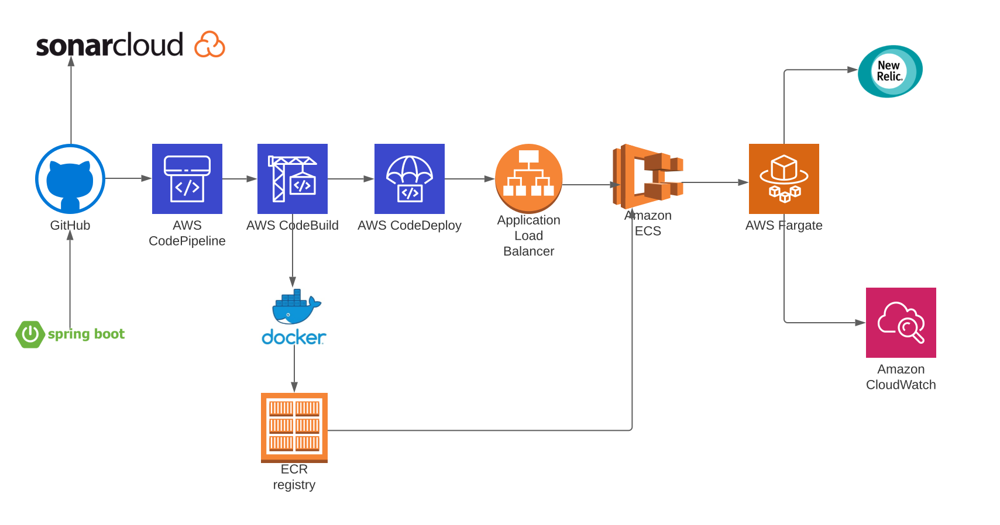

[Reference a specification for Roman numerals online](#roman)
[How to build and run your project.](#how-to-run)
[Engineering and testing methodology](#methodology)
## [Extension 1 Solution](#extension-1)
## [Extension 2 Solution](#extension-2)
## [Extension 2 Solution](#extension-2)
## [Your packaging layout](#deployment-dia)
## [API Documentation](#swagger)
## [Tests](#tests)
## [Error Handling](#error)

## Deployment Diagram<a name="deployment-dia"></a>



- Code Pipeline
  - https://us-west-2.console.aws.amazon.com/codesuite/codepipeline/pipelines/number-to-roman/view?region=us-west-2#

- Sonar Cloud Dashboard
  - https://sonarcloud.io/dashboard?id=iamitshri_number-to-roman-numeral&branch=main

## Development principles <a name="methodology"></a>
- Swagger is used as API documentation  
- GlobalExceptionHandler is used to handle and log exceptions centrally
- IntegerToRomanNumeralController has two endpoints with version v1 and v2
  - Version is added to rest endpoint for safer future upgrades without braking downstream clients
  - Version 1: /v1/romannumeral only supports query parameter
  - Version 2: /v2/romannumeral supports (min and max) or query but not both
- Interface is created for Integer to Roman conversion
  - In the future, adhering to Open Closed Principle, we can swap out implementations
- For controller testing, Mockito is used to mock service class, to test controller independently

### Extension 1 <a name="extension-1"></a>
- Following services implement solution for extension 1
  - IntegerToRomanNumeralService.java 
    - Intuition behind this solution 
    - e.g. Lets look at number 3234
     - 3234 is greater than 1000 which means M repeated 3 times 
     - 234 is greater than 100 which means C repeated for 2 times
     - 34 is greater than 10 which means X repeated 3 times 
     - 4 will be converted using [subtractive notation](https://www.numere-romane.ro/rule3-subtraction-of-basic-symbols-in-roman-numerals.php?lang=en) 
        - which means instead of repeating I four times, we will show it as "IV" (I in front is subtracted from 'V' to get its value)
     - Hence our final solution is MMMCCXXXIV
   - SimplifiedIntegerToRomanNumeralService.java
   - Intuition behind this solution 
      - In the previous solution, we were essentially looking for leftmost integer and based on its decimal position, decide its roman representation
      - For each position of the digit, we keep array of possible values and just do lookup  

### Extension 2 <a name="extension-2"></a>
- RomanNumeralsInRangeService.java
  - This service validates the min and max values from the user 
  - We have reused integer to roman conversion from extension 1 and have added convertAsync method with Async annotation which executes request in separate thread
  - This service essentially then spawns a new thread to convert integer to roman for number in the range of min to max 
  - Each conversion result is returned to the service as CompletableFuture object.
  - Method CompletableFuture.allOf will make sure all the future objects are resolved.
  - Once future objects are resolved, we gather our result in the list
  - In multithreaded execution we can not predict the order of operation, so we will sort the result by integer before returning

### Extension 3 <a name="extension-3"></a>
- We added the following DEVOps capabilities 
     - Runnable Docker image created
     - A CICD pipeline to build and deploy
     - Service deployed on AWS Elastic Container Service
     - Source code metrics are published to the Sonar cloud
     - Application logs are in cloudwatch and are aggregated in newrelic
     - Monitoring, metrics for application is achieved by integrating with NewRelic

- Please refer to the video demonstration of CICD pipeline cretion 
  - https://youtu.be/IVayX7sOZcM
- Sections in the video
- 00:00 [Introduction](https://youtu.be/IVayX7sOZcM)

- 01:30 [Build ECR Container registry](https://youtu.be/IVayX7sOZcM?t=90)

- 01:57 [Code Build to run the build process](https://youtu.be/IVayX7sOZcM?t=117)

- 05:29 [Create Target group](https://youtu.be/IVayX7sOZcM?t=329)

- 06:28 [Create Load balancer](https://youtu.be/IVayX7sOZcM?t=388)

- 08:21 [Create ECS Task Definition](https://youtu.be/IVayX7sOZcM?t=501)

- 10:52 [Create ECS Cluster](https://youtu.be/IVayX7sOZcM?t=652)

- 11:24 [Create ECS Service](https://youtu.be/IVayX7sOZcM?t=684)

- 14:40 [Test the deployment](https://youtu.be/IVayX7sOZcM?t=880)

- 16:46 [Create Code Pipeline to automate build and deploy](https://youtu.be/IVayX7sOZcM?t=1006)

- 19:20 [Trigger the pipeline by commit to GitHub main branch](https://youtu.be/IVayX7sOZcM?t=1160)

- 21:28 [SonarCloud Integration](https://youtu.be/IVayX7sOZcM?t=1288)

- 22:30 [NewRelic How to integrate](https://youtu.be/IVayX7sOZcM?t=1350)

- 23:29 [NewRelic APM Demo](https://youtu.be/IVayX7sOZcM?t=1409)

- 24:37 [NewRelic Alerting demo](https://youtu.be/IVayX7sOZcM?t=1477)

- 26:57 [NewRelic Logs demo](https://youtu.be/IVayX7sOZcM?t=1617)

- 28:07 [NewRelic General Features](https://youtu.be/IVayX7sOZcM?t=1687)


## Tests 
- Unit Tests
  - Service class is tested for all the  valid input range
    - AbstractIntegerToRomanNumeralTest.java
      - This class has a method to read the excel file 
    - Valiadation for Integer to Roman 
      - Test Data: Excel file is created with number in range [1-3999] to roman representation
      - Integer to Roman integer implementations is validated by reading this file and comparing actual vs expected
  - Controller is independently unit tested by mocking service class 
- Integration Test
  - Application Context initialization is checked


## Swagger Documentation <a name="swagger"></a>
- [Swagger Link](http://number-to-numeral-load-balancer-1676602525.us-west-2.elb.amazonaws.com/swagger-ui.html)

## Prerequisites
- Setup JDK 11,Maven and Docker
- Intellij or Eclipse
- AWS and NewRelic account is accessible

## [How to run](#how-to-run)

## Local
  - ```git clone https://github.com/iamitshri/number-to-roman-numeral.git```
  - ```cd number-to-roman-numeral```
  - ```./mvnw spring-boot:run```
  - ``` curl 'http://localhost:8080/v1/romannumeral?query=1'```

  ### Running with newrelic locally
      mvn clean install
      java -javaagent:"/absolute-path/number-to-roman-numeral/newrelic/newrelic.jar" -jar target/number-to-roman-numeral.jar
  ## AWS
 
  #### Check the version deployed in AWS ECS
    ````
    curl 'http://number-to-numeral-load-balancer-1676602525.us-west-2.elb.amazonaws.com/v1/romannumeral?query=3434'
    ````  
  ### How to build Docker Image
  - ```docker build -t numer-to-roman/number-to-roman-numeral .```
  - ``` docker run -p 8080:8080 numer-to-roman/number-to-roman-numeral ```
    - Stop the docker image
      - ```docker container ls```
      - ```docker stop containerId```
  - Optional Using build packs
    - ./mvnw spring-boot:build-image


## References
### Roman specification <a name="roman"></a>
- https://en.wikipedia.org/wiki/Roman_numerals
## Docker Image creation
- https://spring.io/blog/2020/01/27/creating-docker-images-with-spring-boot-2-3-0-m1
- [Docker installation https://docs.aws.amazon.com/AmazonECS/latest/developerguide/docker-basics.html](https://docs.aws.amazon.com/AmazonECS/latest/developerguide/docker-basics.html)
- https://docs.aws.amazon.com/codebuild/latest/userguide/sample-docker.html
## Building CICD
- https://docs.aws.amazon.com/codepipeline/latest/userguide/ecs-cd-pipeline.html
## New Relic Log ingestion
- https://serverlessrepo.aws.amazon.com/applications/us-east-1/463657938898/NewRelic-log-ingestion
